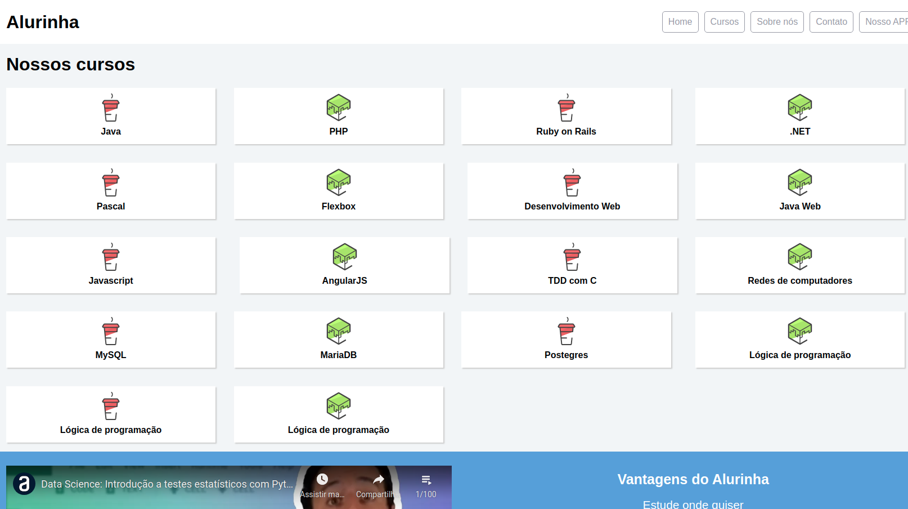

# Alurinha

---

Esse projeto consiste de uma página WEB estática responsiva construída com HTML5 e CSS3 simulando uma página de listagem de cursos oferecidos na Alura.

---

Projeto desenvolvido no curso de Flexbox da Alura.
